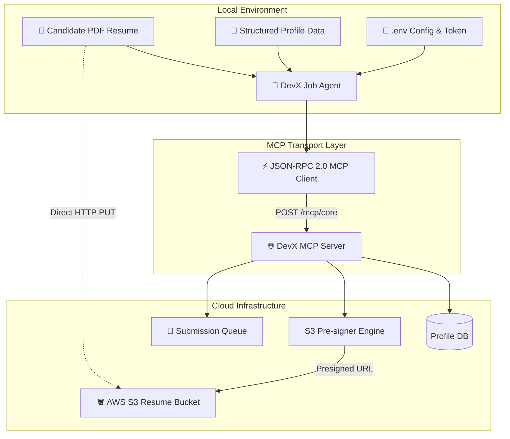

# Building an Autonomous Job Application Agent with Model Context Protocol (MCP) and Python

### *How I built an AI agent that synchronizes candidate profiles, streams resumes to S3, and applies for tech roles end-to-end using MCP.*

---


*Photo by Unsplash / Modern AI Architecture & Systems*

---

## 🚀 Introduction: The Shift from Manual Forms to Agentic MCP

Applying for tech jobs has notoriously remained stuck in the 2010s: endless form fields, re-entering resume bullet points, broken ATS parsers, and opaque submission confirmations.

What if your AI agent could negotiate directly with hiring infrastructure over a standardized protocol?

Enter the **Model Context Protocol (MCP)**. MCP isn't just for local file manipulation or search tools — it represents a foundational shift in how applications, AI agents, and cloud platforms exchange state and perform actions.

In this article, I will walk you through how I architected and built an end-to-end **Autonomous Job Application Agent** in Python that interacts with **DevX Labs' hiring MCP server**. We'll cover:

1. **Protocol Fundamentals**: How JSON-RPC 2.0 powers MCP tool calls over HTTP.
2. **Dynamic Profile Synchronization**: Extracting and updating structured career experience, education, and skill vectors.
3. **Secure Binary Streaming**: Requesting pre-signed AWS S3 upload URLs and streaming PDF resumes without exposing cloud credentials.
4. **Audit Session Logs & Safe Submission**: Uploading execution transcripts and handling server lifecycle states (e.g., HTTP 409 conflict when applications are under review).

---

## 🏛️ System Architecture

Before diving into code, let's look at how the data flows between the local runner, the MCP client layer, and DevX's cloud infrastructure:



---

## 🛠️ Step 1: Crafting the JSON-RPC 2.0 MCP Client

MCP tool invocations are standardized as JSON-RPC 2.0 payloads. Each request defines a method `tools/call`, the tool name, and input parameters.

Here is the clean implementation in `mcp_client.py`:

```python
import json
import requests
from typing import Dict, Any, Optional

class DevXMCPClient:
    """Client for executing Model Context Protocol (MCP) tools."""

    def __init__(self, base_url: str, token: str):
        self.base_url = base_url.rstrip("/")
        self.headers = {
            "Authorization": f"Bearer {token}",
            "Content-Type": "application/json"
        }

    def call_tool(self, name: str, arguments: Optional[Dict[str, Any]] = None) -> Dict[str, Any]:
        """Calls an MCP tool with JSON-RPC 2.0 packaging and detailed error unwrapping."""
        payload = {
            "jsonrpc": "2.0",
            "id": 1,
            "method": "tools/call",
            "params": {
                "name": name,
                "arguments": arguments or {}
            }
        }
        
        try:
            response = requests.post(
                self.base_url,
                headers=self.headers,
                json=payload,
                timeout=30
            )
        except requests.RequestException as e:
            raise RuntimeError(f"Network error connecting to {self.base_url}: {e}")

        # Unwrap backend details on 4xx/5xx responses
        if not response.ok:
            error_details = response.text
            try:
                err_json = response.json()
                if isinstance(err_json, dict):
                    error_details = err_json.get("detail") or err_json.get("error") or err_json.get("message") or response.text
            except Exception:
                pass
            raise RuntimeError(f"DevX Server Error ({response.status_code}): {error_details}")

        result = response.json()
        if "error" in result:
            raise RuntimeError(f"MCP Tool Error: {result['error']}")
        return result.get("result", {})
```

---

## ⚡ Step 2: Direct Binary S3 Streaming via Pre-Signed URLs

Instead of sending megabyte-heavy PDF binaries through the JSON-RPC endpoint, modern architecture uses **pre-signed URLs**. 

The MCP tool `get_resume_upload_url` returns a temporary, scoped S3 URL. Our client streams the PDF directly to AWS S3, then links the resulting `resume_s3_key` to the candidate's profile:

```python
def upload_resume(self, resume_path: str) -> str:
    """Requests S3 upload URL, streams PDF, and updates candidate profile."""
    filename = os.path.basename(resume_path)
    
    # 1. Ask MCP server for a presigned upload URL
    res = self.client.call_tool("get_resume_upload_url", {"filename": filename})
    upload_url = res.get("upload_url")
    resume_s3_key = res.get("resume_s3_key")

    # 2. Binary stream direct to S3
    with open(resume_path, "rb") as f:
        data = f.read()
    
    s3_response = requests.put(
        upload_url,
        data=data,
        headers={"Content-Type": "application/pdf"},
        timeout=60
    )
    s3_response.raise_for_status()

    # 3. Associate the S3 Key with candidate profile
    self.client.call_tool("update_my_profile", {"resume_s3_key": resume_s3_key})
    return resume_s3_key
```

---

## 🧠 Step 3: Profile Enrichment & Screening Validation

With MCP, updating candidate details (experience, education, repositories) is as simple as structured dictionary updates:

```python
candidate_payload = {
    "name": "Jatinkumar Parmar",
    "email": "parmarjatin4911@gmail.com",
    "phone": "+91-70166-81896",
    "experience": [
        {
            "company": "Trizen Ventures AI",
            "role": "Senior AI Architect",
            "period": "Jan 2026 – Present",
            "highlights": "Led generative AI pipelines, Vertex AI deployments, and LLM optimization."
        },
        {
            "company": "SHIVA AI LLP & EZ LLM",
            "role": "AI/ML Researcher & Founder",
            "period": "Jan 2023 – Jan 2025",
            "highlights": "Architected low-latency RAG systems and autonomous agent frameworks."
        }
    ],
    "skills": ["Machine Learning", "Python", "Vertex AI", "AWS S3", "MCP", "FastAPI"]
}

# Push structured data directly
client.call_tool("update_my_profile", candidate_payload)
```

---

## 🛡️ Step 4: Graceful Lifecycle & Conflict Handling

A critical aspect of production agent systems is **idempotency and lifecycle handling**.

When an application is already submitted or locked for recruiter evaluation, the DevX server returns an informative JSON-RPC payload with HTTP 409:

```json
{
  "code": -32002,
  "message": "You've already applied to this role (status: Applied). It's under review — there's nothing more to submit."
}
```

By properly catching HTTP 409 and parsing the message body, our CLI avoids crashes and provides immediate feedback to the applicant:

```
╭────────────────────────────────────────╮
│ DevX Labs — Job Application Agent      │
│ Automated MCP-based Application Runner │
╰────────────────────────────────────────╯

Step 1: Fetching current profile and position...
✓ Status: Applied (Under Review)
ℹ There is nothing more to submit. Your profile is in the recruiter queue!
```

---

## 🌟 Interactive Web Dashboard

To complement the CLI runner, we built a glassmorphic dashboard showcasing real-time candidate sync status, profile breakdown, and application stage tracking.

```powershell
# Open live candidate dashboard
start devx-job-agent/web/index.html
```

---

## 🎯 Key Takeaways & What's Next

1. **Protocol Standardisation Wins**: Model Context Protocol decouples agent logic from API quirks. Whether interacting with local databases, dev tools, or enterprise hiring portals, standard tool calls make agents composable and reusable.
2. **Security by Design**: Pre-signed URLs ensure agents never need long-lived AWS IAM credentials on the client machine.
3. **Observability Matters**: Generating audit transcripts (`save_session_log`) guarantees complete transparency for both hiring teams and candidates.

---

### 🔗 Code Repository & Links

- **GitHub Repository:** [https://github.com/parmarjh/DevX-Labs-Job-Application-Agent](https://github.com/parmarjh/DevX-Labs-Job-Application-Agent)
- **LinkedIn:** [linkedin.com/in/jhparmar](https://www.linkedin.com/in/jhparmar)
- **Live Portfolio:** [shivaiaillp.lovable.app](https://shivaiaillp.lovable.app)

*If you found this breakdown insightful, give it a clap 👏 and follow for more deep-dives into Agentic AI, MCP, and production ML pipelines!*
