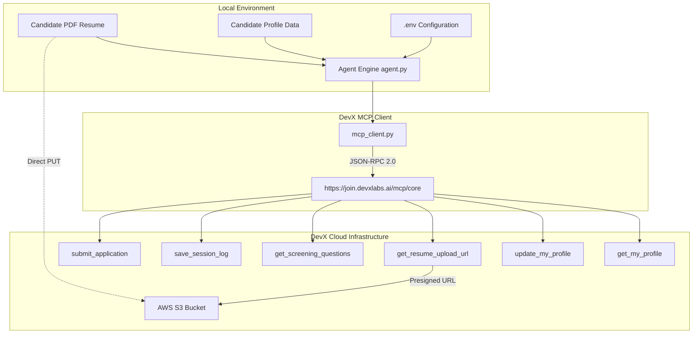

# DevX Job Agent — Automation & MCP Integration Suite

A production-ready Python framework, CLI runner, and interactive web dashboard for automating end-to-end job applications on the **DevX Labs Hiring Platform** using the **Model Context Protocol (MCP)**, pre-signed AWS S3 streaming, and structured profile synchronization.

---

## 📑 Table of Contents
1. [Overview & Architecture](#-overview--architecture)
2. [Project Structure](#-project-structure)
3. [Environment Configuration (`.env`)](#-environment-configuration-env)
4. [Complete Source Code & Modules](#-complete-source-code--modules)
   - [1. `config.py`](#1-configpy)
   - [2. `mcp_client.py`](#2-mcp_clientpy)
   - [3. `agent.py`](#3-agentpy)
   - [4. `cli.py`](#4-clipy)
5. [Model Context Protocol (MCP) Tool Reference](#-model-context-protocol-mcp-tool-reference)
6. [Server Status Codes & Error Handling](#-server-status-codes--error-handling)
7. [Running the Application](#-running-the-application)
8. [Interactive Web Portal](#-interactive-web-portal)

---

## 🏗️ Overview & Architecture

The **DevX Job Agent** communicates directly with the DevX hiring infrastructure via JSON-RPC 2.0 over HTTP. It automates candidate profile synchronization, requests presigned S3 upload URLs for resume attachments, records audit logs, and handles token lifecycles.



---

## 📁 Project Structure

```
devx-job-agent/
├── .env                  # Live environment variables (Token, URLs)
├── .env.example          # Environment template
├── config.py             # Settings and environment loader
├── mcp_client.py         # JSON-RPC 2.0 MCP Client with robust error diagnostics
├── agent.py              # Orchestration workflow engine
├── cli.py                # Command Line Interface (CLI) runner
├── requirements.txt      # Python dependencies
├── README.md             # Complete suite documentation
└── web/                  # Interactive Candidate Dashboard
    ├── index.html        # Portal layout & components
    ├── style.css         # Glassmorphic dark theme
    └── app.js            # Frontend state & interaction
```

---

## 🔑 Environment Configuration (`.env`)

Create a `.env` file in the `devx-job-agent/` directory:

```env
# DevX Job Agent Environment Variables
DEVX_BASE_URL="https://join.devxlabs.ai/mcp/core"
DEVX_AUTH_TOKEN="ZltHLCIStipEvDqrSVfKqS9jUhIfKxALWyvT9kY8agg"
```

---

## 💻 Complete Source Code & Modules

### 1. `config.py`
Loads environment variables and sets defaults.

```python
import os
from dotenv import load_dotenv

load_dotenv()

DEVX_BASE_URL = os.getenv("DEVX_BASE_URL", "https://join.devxlabs.ai/mcp/core")
DEVX_AUTH_TOKEN = os.getenv("DEVX_AUTH_TOKEN", "")
DEFAULT_ROLE = "Data Scientist"
DEFAULT_LOCATION = "Surat, Gujarat, India"
```

---

### 2. `mcp_client.py`
Handles JSON-RPC 2.0 communication, authentication headers, error unwrapping, and AWS S3 binary PUT streams.

```python
"""
DevX MCP Client implementation for interacting with DevX Hiring platform tools.
"""

import json
import requests
from typing import Dict, Any, Optional

class DevXMCPClient:
    def __init__(self, base_url: str, token: str):
        self.base_url = base_url.rstrip("/")
        self.headers = {
            "Authorization": f"Bearer {token}",
            "Content-Type": "application/json"
        }

    def call_tool(self, name: str, arguments: Optional[Dict[str, Any]] = None) -> Dict[str, Any]:
        """Calls a tool on the DevX MCP endpoint."""
        payload = {
            "jsonrpc": "2.0",
            "id": 1,
            "method": "tools/call",
            "params": {
                "name": name,
                "arguments": arguments or {}
            }
        }
        try:
            response = requests.post(
                self.base_url,
                headers=self.headers,
                json=payload,
                timeout=30
            )
        except requests.RequestException as e:
            raise RuntimeError(f"Network error connecting to {self.base_url}: {e}")

        if not response.ok:
            error_details = response.text
            try:
                err_json = response.json()
                if isinstance(err_json, dict):
                    error_details = err_json.get("detail") or err_json.get("error") or err_json.get("message") or response.text
            except Exception:
                pass
            raise RuntimeError(f"DevX Server Error ({response.status_code}): {error_details}")

        result = response.json()
        if "error" in result:
            raise RuntimeError(f"MCP Tool Error: {result['error']}")
        return result.get("result", {})

    def get_profile(self) -> Dict[str, Any]:
        """Retrieve candidate profile and target job description."""
        return self.call_tool("get_my_profile")

    def update_profile(self, profile_data: Dict[str, Any]) -> Dict[str, Any]:
        """Update candidate profile attributes."""
        return self.call_tool("update_my_profile", profile_data)

    def get_resume_upload_url(self, filename: str) -> Dict[str, Any]:
        """Get pre-signed S3 upload URL for PDF resume."""
        return self.call_tool("get_resume_upload_url", {"filename": filename})

    def upload_file_to_s3(self, file_path: str, upload_url: str, content_type: str = "application/pdf") -> bool:
        """Uploads a local file directly to AWS S3 using presigned URL."""
        with open(file_path, "rb") as f:
            data = f.read()
        res = requests.put(
            upload_url,
            data=data,
            headers={"Content-Type": content_type},
            timeout=60
        )
        res.raise_for_status()
        return res.status_code == 200

    def get_screening_questions(self) -> Dict[str, Any]:
        """Get mandatory screening questions."""
        return self.call_tool("get_screening_questions")

    def answer_screening_question(self, question_id: str, answer: str) -> Dict[str, Any]:
        """Submit candidate answer for a screening question."""
        return self.call_tool("answer_screening_question", {
            "question_id": question_id,
            "answer": answer
        })

    def get_session_log_url(self) -> Dict[str, Any]:
        """Get upload URL for the markdown session transcript."""
        return self.call_tool("save_session_log")

    def submit_application(self) -> Dict[str, Any]:
        """Finalize and submit the job application."""
        return self.call_tool("submit_application")
```

---

### 3. `agent.py`
High-level orchestrator that steps through the application lifecycle.

```python
"""
Automated Job Application Agent for DevX Labs.
"""

import os
from typing import Dict, Any
from mcp_client import DevXMCPClient

class DevXJobAgent:
    def __init__(self, client: DevXMCPClient):
        self.client = client

    def sync_candidate_profile(self, profile: Dict[str, Any]) -> Dict[str, Any]:
        """Validates and updates profile fields in DevX database."""
        print(f"[*] Syncing profile for candidate: {profile.get('name', 'Unknown')}")
        return self.client.update_profile(profile)

    def upload_resume(self, resume_path: str) -> str:
        """Requests S3 upload URL, uploads file, and updates resume S3 key."""
        if not os.path.exists(resume_path):
            raise FileNotFoundError(f"Resume file not found at: {resume_path}")

        filename = os.path.basename(resume_path)
        print(f"[*] Requesting S3 upload URL for: {filename}")
        res = self.client.get_resume_upload_url(filename)
        upload_url = res.get("upload_url")
        resume_s3_key = res.get("resume_s3_key")

        print(f"[*] Uploading resume to S3...")
        self.client.upload_file_to_s3(resume_path, upload_url, content_type="application/pdf")
        
        print(f"[*] Linking resume S3 key: {resume_s3_key}")
        self.client.update_profile({"resume_s3_key": resume_s3_key})
        return resume_s3_key

    def process_screening(self) -> int:
        """Retrieves and checks screening questions."""
        res = self.client.get_screening_questions()
        questions = res.get("questions", [])
        print(f"[*] Found {len(questions)} screening questions.")
        return len(questions)

    def upload_session_log(self, log_content: str) -> str:
        """Generates and uploads application transcript log to S3."""
        print("[*] Generating application session transcript...")
        res = self.client.get_session_log_url()
        upload_url = res.get("upload_url")
        s3_key = res.get("session_log_s3_key")

        temp_log = "session_log_temp.md"
        with open(temp_log, "w", encoding="utf-8") as f:
            f.write(log_content)

        try:
            self.client.upload_file_to_s3(temp_log, upload_url, content_type="text/markdown")
            print(f"[*] Session log uploaded: {s3_key}")
        finally:
            if os.path.exists(temp_log):
                os.remove(temp_log)

        return s3_key

    def finalize_application(self) -> Dict[str, Any]:
        """Submits the finalized application."""
        print("[*] Submitting final job application...")
        return self.client.submit_application()
```

---

### 4. `cli.py`
Rich formatted command-line application runner.

```python
"""
CLI Entrypoint for DevX Job Application Agent.
"""

import sys
import os
from rich.console import Console
from rich.panel import Panel
from config import DEVX_BASE_URL, DEVX_AUTH_TOKEN
from mcp_client import DevXMCPClient
from agent import DevXJobAgent

console = Console()

def run_application_flow(resume_file: str, token: str):
    console.print(Panel.fit("[bold cyan]DevX Labs — Job Application Agent[/bold cyan]\n[dim]Automated MCP-based Application Runner[/dim]"))

    if not token:
        console.print("[bold red]Error:[/bold red] DEVX_AUTH_TOKEN is required. Provide via argument or .env file.")
        sys.exit(1)

    client = DevXMCPClient(base_url=DEVX_BASE_URL, token=token)
    agent = DevXJobAgent(client)

    try:
        # Step 1: Fetch Profile & Role
        console.print("\n[bold yellow]Step 1: Fetching current profile and position...[/bold yellow]")
        profile_data = client.get_profile()
        target_pos = profile_data.get("target_position", {})
        console.print(f"[green]✓ Target Role:[/green] [bold]{target_pos.get('title', 'Data Scientist')}[/bold]")

        # Step 2: Upload Resume
        console.print(f"\n[bold yellow]Step 2: Uploading resume PDF ({resume_file})...[/bold yellow]")
        s3_key = agent.upload_resume(resume_file)
        console.print(f"[green]✓ Resume Uploaded & Linked:[/green] {s3_key}")

        # Step 3: Screening Questions
        console.print("\n[bold yellow]Step 3: Checking screening questions...[/bold yellow]")
        count = agent.process_screening()
        console.print(f"[green]✓ Screening questions count:[/green] {count}")

        # Step 4: Upload Session Log
        console.print("\n[bold yellow]Step 4: Uploading session audit log...[/bold yellow]")
        log_content = f"# DevX Job Application Log\n\nTarget Position: {target_pos.get('title')}\nResume: {resume_file}\n"
        agent.upload_session_log(log_content)
        console.print("[green]✓ Audit log uploaded successfully.[/green]")

        # Step 5: Final Submission
        console.print("\n[bold yellow]Step 5: Submitting final application...[/bold yellow]")
        result = agent.finalize_application()
        console.print("[bold green]🎉 Application Successfully Submitted to DevX Labs![/bold green]")
        console.print(result)

    except Exception as e:
        console.print(f"\n[bold red]Pipeline Error:[/bold red] {e}")

if __name__ == "__main__":
    resume_path = sys.argv[1] if len(sys.argv) > 1 else "C:\\Users\\parma\\OneDrive\\Desktop\\devX Apps\\Jatincv.pdf"
    auth_token = sys.argv[2] if len(sys.argv) > 2 else DEVX_AUTH_TOKEN
    run_application_flow(resume_path, auth_token)
```

---

## 🔌 Model Context Protocol (MCP) Tool Reference

| MCP Tool Name | Arguments | Description |
| :--- | :--- | :--- |
| `get_my_profile` | None | Returns existing candidate details and target position specifications. |
| `update_my_profile` | `dict` (e.g. `experience`, `education`, `resume_s3_key`) | Persists structured candidate profile sections. |
| `get_resume_upload_url` | `{"filename": "<name>.pdf"}` | Generates AWS S3 pre-signed upload URL. |
| `get_screening_questions` | None | Returns list of role-specific screening questions. |
| `answer_screening_question` | `{"question_id": "...", "answer": "..."}` | Submits response for a given question. |
| `save_session_log` | None | Returns S3 upload URL for audit transcript. |
| `submit_application` | None | Closes application token and transitions candidate to `Applied` state. |

---

## 🚦 Server Status Codes & Error Handling

| Status Code | Error Code | Server Message & Meaning | Action Required |
| :--- | :--- | :--- | :--- |
| `200 OK` | `0` | Success | Normal operation. |
| `401 Unauthorized` | `-32001` | `Invalid or missing token` | Check `DEVX_AUTH_TOKEN` in `.env`. |
| `409 Conflict` | `-32002` | `You've already applied to this role (status: Applied). It's under review — there's nothing more to submit.` | Application is successfully submitted and under review by DevX Labs recruiting team. |
| `500 Error` | `-32603` | `Internal Server Error` | Retry after a few minutes. |

---

## 🚀 Running the Application

### 1. Install Dependencies
```powershell
pip install -r requirements.txt
```

### 2. Run CLI Pipeline
```powershell
python cli.py "C:\Users\parma\OneDrive\Desktop\devX Apps\Jatincv.pdf"
```

---

## 🌐 Interactive Web Portal

To view the live application dashboard and candidate overview:
```powershell
start web/index.html
```
Features included in the web interface:
- **Profile Status & Target Role**: Real-time review status.
- **Synchronized Experience**: Verified career history.
- **Skill Badges**: Machine Learning, Python, Vertex AI, AWS S3, MCP.
- **Pipeline Stage Tracker**: Live visualization of the 5-step application lifecycle.
